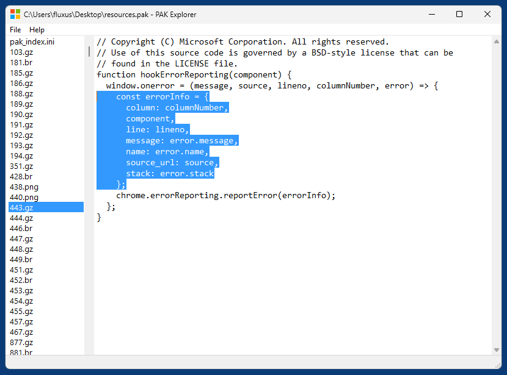

# PAK Explorer

PAK Explorer is a simple portable tool for Windows that allows to explore Chrome/Chromium/Edge/WebView2 resource PAK files and edit text resources like e.g. JS code, CSS files etc.

A PAK file can be loaded either be dropping it into the application window or selecting "Open PAK File..." from the menu.

All resources in the PAK file are displayed in a listbox on the left. When selecting a resource, it is loaded into the text control on the right, either as editable text (for all text resources) or as read-only hex view (for all binary resources, like e.g. PNG files). Binary resources can't be edited inside the tool, but you can manually replace them with edited files inside the temporary directory (data/tmp) before saving as new PAK file.

When saving as new PAK file, all edited resources are compressed with the original compression (Brotli, GZIP or None).

Double clicking a PNG resource in the listbox on the left opens it with the associated default image viewer (in my case that's IrfanView).

PAK Explorer is based on [chrome-pak-customizer](https://github.com/myfreeer/chrome-pak-customizer) (Release 3.0-nightly-20251007).

